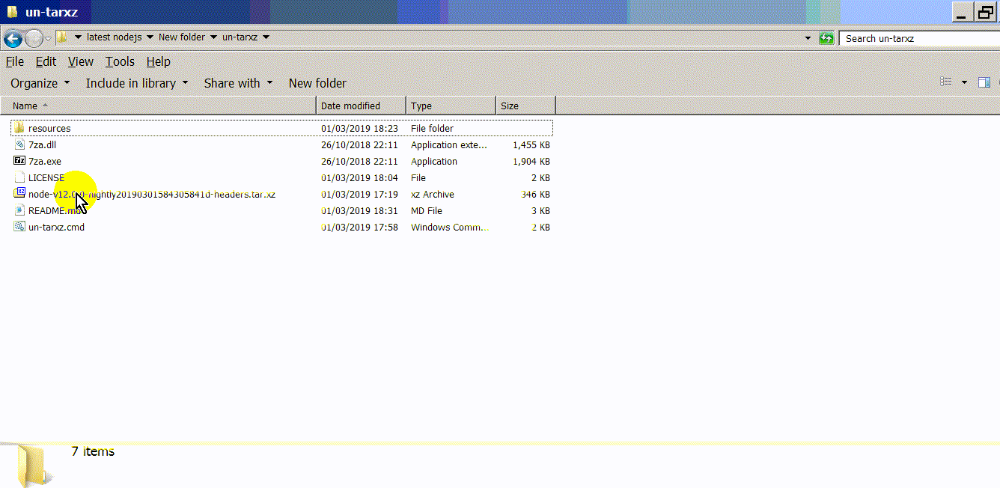

<h1> <em>un-tarxz</em></h1>
<strong>Windows-Ready</strong>, Drag&amp;Drop any <code>tar.xz</code>, <code>tar.gz</code>, ... <br/>
over <code>un-tarxz.cmd</code> to extract the content to the current folder. <br/>
Fast. <br/>
Efficient. <br/>
No Temporary Files. <br/>

<hr/>

No Dependencies. <br/>
Modified, portable <a href="https://github.com/mcmilk/7-Zip-zstd">7zip</a> included, <br/>
with additional support for Brotli, Fast-LZMA2, Lizard, LZ4, LZ5 and Zstandard. <br/>

 <br/>

<hr/>
<h2>How to use</h2>
Download https://github.com/eladkarako/un-tarxz/archive/master.zip <br/>
Unzip and place anywhere, it is 100% portable. <br/>
and either launch <code>un-tarxz.cmd</code> with a compressed filename (something like <code>____.tar.gz</code> or <codE>____.tar.xz</code>), <br/>
or drag&amp;drop the file over it to extract your compressed-file.

You may add the un-tarxz folder to your system's-PATH https://www.computerhope.com/issues/ch000549.htm (optional) <br/>
so you can run <code>un-tarxz.cmd</code> from any folder, extracting compressed-files anywhere without the need to copy them to the same folder as the <code>un-tarxz.cmd</code> is in.
<hr/>

<h2>Integration - Placing dependencies</h2>
You may integrate the batch-file and binaries into your project, <br/>
all paths included are relative, so everything will work fine as long the files are at the same folder. <br/>

<h2>Integration - Exit-Code</h2>
The program forwards the exit-codes of 7zip, <br/>
there is no distinction if the exit code was from the first (before the pipeline) execute of 7zip, <br/>
or the second (after the pipeline) execute of the 7zip. <br/>

<hr/>

<h3>Developers:</h3>
If you want an additional folder-wrapping for the output, <br/>
use the line: <br/>

```cmd
call "%~sdp07za.exe" x "%FOLDER%\%LAYER1%" -so  |  "%~sdp07za.exe" x -aoa -si -ttar -o"%LAYER3%"
```

instead-of: 

```cmd
  call "%~sdp07za.exe" x "%FOLDER%\%LAYER1%" -so  |  "%~sdp07za.exe" x -aoa -si -ttar
```

in the batch-file.

<br/>

<hr/>

<h3>7Zip component</h3>

The <code>7za.exe</code> and <code>7za.dll</code> are a slightly modified <br/>
versions of https://github.com/mcmilk/7-Zip-zstd , and 100% portable. <br/>
it is the x86 version, which you may override with x64 version if you want from: <br/>
https://github.com/eladkarako/mods/tree/store/7zip/64bit <br/>


